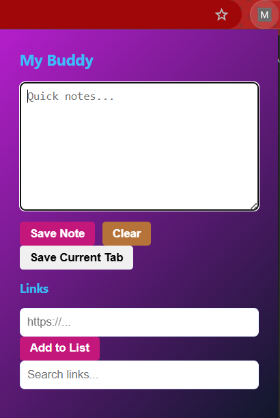
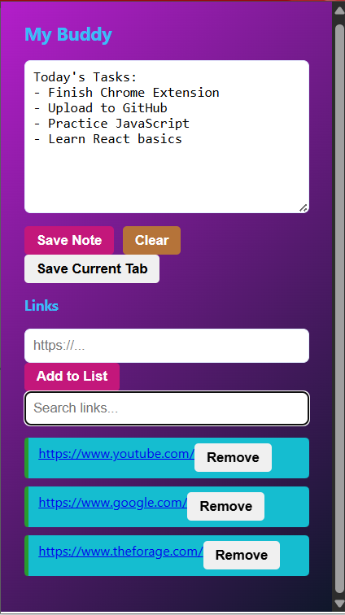
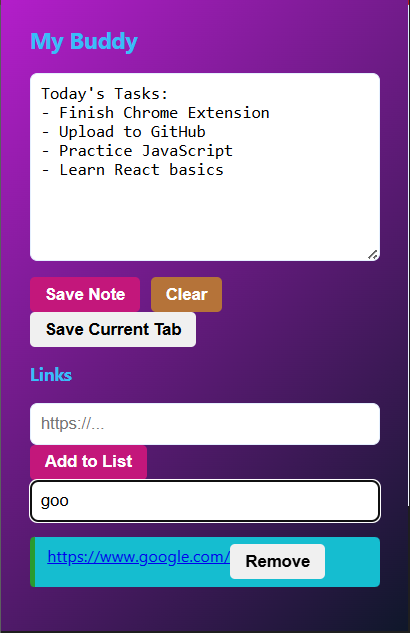
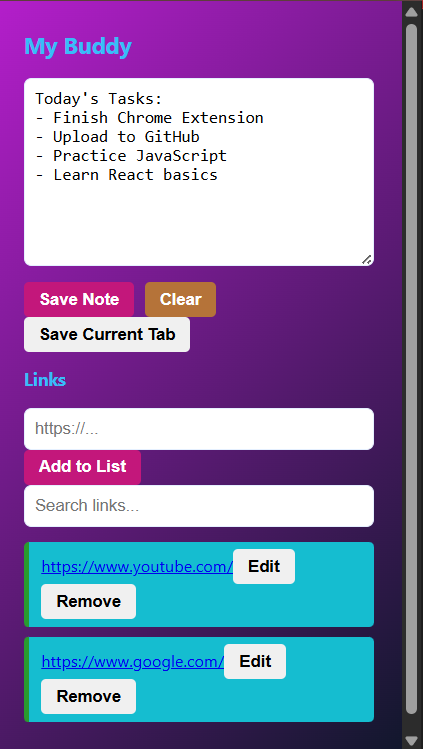
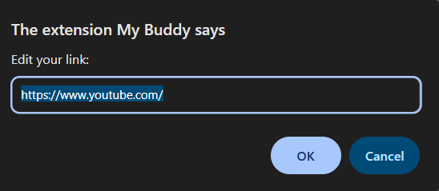

My Buddy – Smart Notes & Link Saver 

Hey
This is My Buddy, a simple Chrome extension I built to help you save notes and useful links in one place.

What My Buddy can do
-  Save your notes quickly  
-  Store useful links  
-  Save your current tab instantly  
-  Delete links anytime  
-  Search through saved links  
-  Prevent invalid inputs
-  Edit saved links

Built With
- HTML  
- CSS  
- JavaScript  
- Chrome Storage API  

How to Use
1. Open the extension  
2. Add notes or links  
3. Save your current tab  
4. Search anything easily  
Think of it like your small digital buddy that remembers things for you.

Screenshots

1.Notes & Main UI

2.Saved Links

3.Search Feature

4.Edit links

